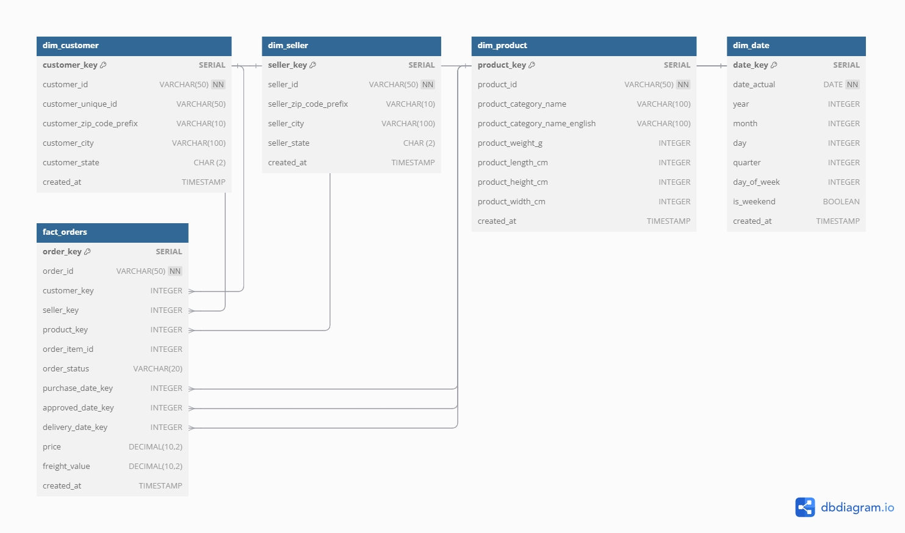

# Olist E-commerce Data Warehouse Project

## Project Overview
This project demonstrates a comprehensive data warehouse implementation for the Brazilian E-commerce dataset from Olist. It showcases both traditional ETL processes and modern data transformation approaches, combining Python-based ETL, dbt (data build tool) for transformations, and Docker for containerization. The project creates a dimensional model optimized for business intelligence and analysis.

## Architecture


Our data warehouse follows a robust architectural design:

### Star Schema Design
The warehouse implements a star schema with:
- **Central Fact Table**: fact_orders, containing transactional metrics and foreign keys
- **Dimension Tables**: 
  - dim_customer (customer demographics)
  - dim_seller (seller information)
  - dim_product (product details)
  - dim_date (time-based analysis)

### Implementation Approaches

#### 1. Traditional ETL Pipeline
The base implementation uses Python for:
- Data extraction from CSV sources
- Complex transformations
- Loading into PostgreSQL
- Data quality validation

#### 2. DBT Implementation
Our dbt layer provides:
- SQL-first transformations
- Automated testing framework
- Documentation generation
- Version-controlled transformations
- Modular model development

#### 3. Docker Containerization
The containerized environment includes:
- PostgreSQL database
- Python ETL application
- DBT transformations
- Orchestrated using Docker Compose

## Project Structure
```
ecommerce-data-warehouse/
├── config/
│   └── database.ini          # Database configuration
├── data/
│   ├── processed/            # Transformed data
│   └── raw/                  # Olist CSV files
├── dbt_olist/               # DBT implementation
│   ├── models/
│   │   ├── staging/         # Initial transformations
│   │   ├── intermediate/    # Helper models
│   │   ├── dim/            # Dimension tables
│   │   ├── fact/           # Fact tables
│   │   └── mart/           # Business-specific models
│   └── tests/              # Data quality tests
├── docker/                  # Docker configuration
│   ├── Dockerfile          # ETL application
│   ├── Dockerfile.dbt      # DBT environment
│   └── docker-compose.yml  # Service orchestration
├── notebooks/              # Analysis notebooks
├── src/                    # Source code
└── tests/                  # Test files
```

## Getting Started

### Prerequisites
- Docker and Docker Compose
- Python 3.8+
- PostgreSQL 12+
- DBT 1.9.0+

### Installation Options

#### 1. Using Docker (Recommended)
```bash
# Clone the repository
git clone https://github.com/LeoRigasaki/ecommerce-data-warehouse.git
cd ecommerce-data-warehouse

# Start the containerized environment
docker-compose up --build
```

#### 2. Local Development
```bash
# Create virtual environment
python -m venv venv
source venv/bin/activate  # Linux/Mac
# or
venv\Scripts\activate     # Windows

# Install dependencies
pip install -r requirements.txt

# Configure database
cp config/database.ini.example config/database.ini
# Update database.ini with your credentials
```

## Usage

### Running the Pipeline

#### Using Docker
```bash
# Run entire pipeline
docker-compose up

# Run DBT transformations
docker-compose run dbt run
```

#### Local Development
```bash
# Run Python ETL
python run.py

# Run DBT models
cd dbt_olist
dbt run
```

### Data Analysis
1. Access the data warehouse:
```sql
psql -U dwh_user -d ecommerce_dwh
```

2. Run business queries:
```bash
python -m src.analysis.business_queries
```

3. View DBT documentation:
```bash
dbt docs generate
dbt docs serve
```

## Key Features

### ETL Pipeline
- Robust data extraction and transformation
- Error handling and logging
- Data quality validation
- Incremental loading capability

### DBT Transformations
- Modular SQL transformations
- Built-in testing framework
- Automated documentation
- Dependency management

### Docker Implementation
- Containerized services
- Reproducible environment
- Easy deployment
- Scalable architecture

## Development Branches
- main: Core implementation
- feature/dbt: DBT transformations
- feature/docker: Containerization
- Future: Airflow implementation

## Acknowledgments
- DBT community
- Docker community
- PostgreSQL community
- Dataset provided by Olist Store
- Brazilian E-commerce Public Dataset by Olist on Kaggle